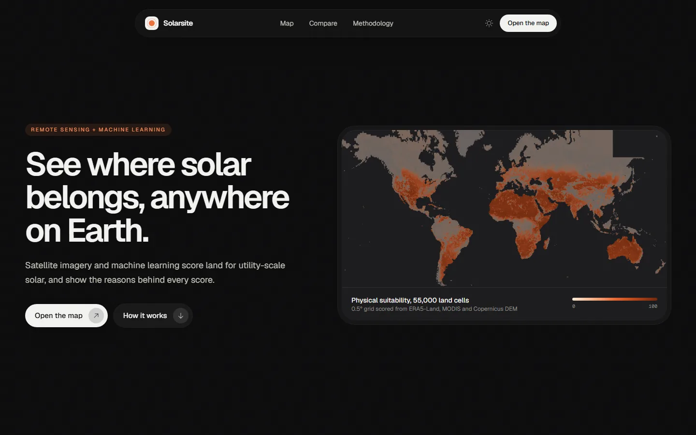
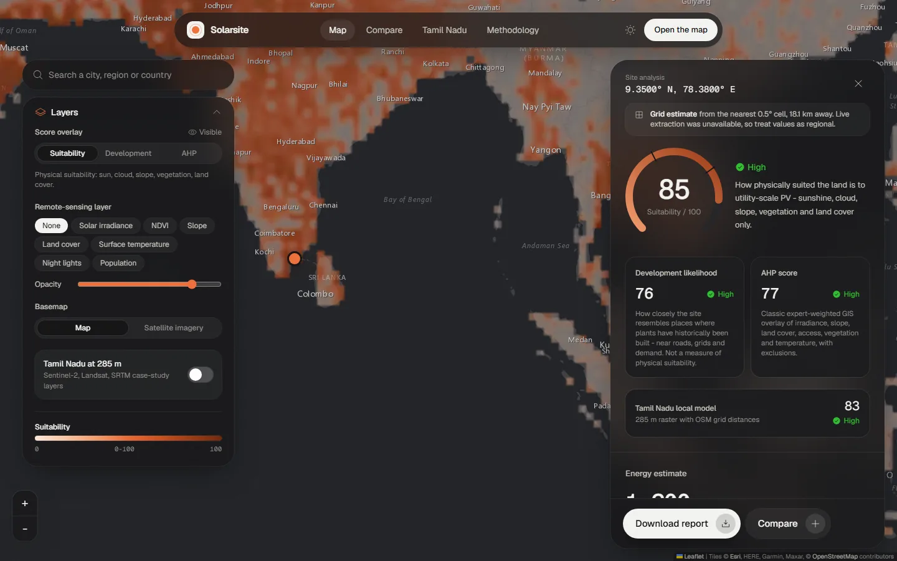
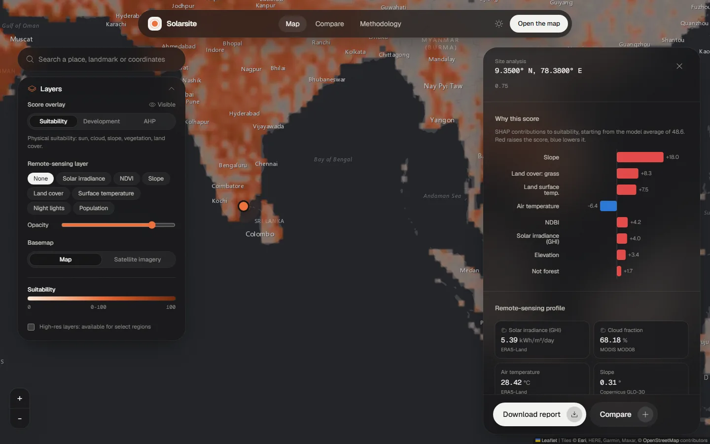
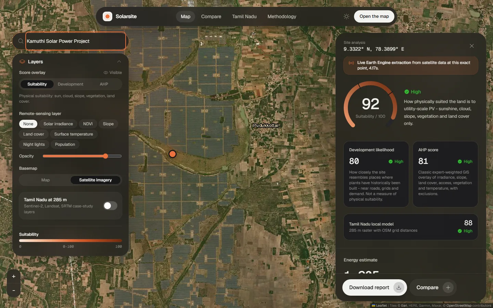
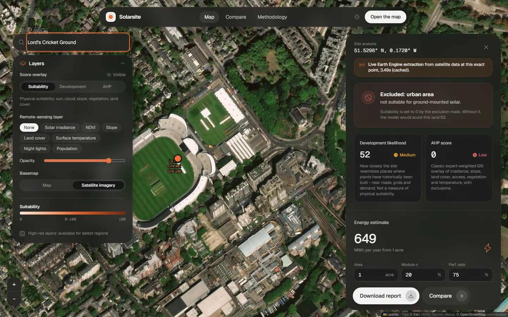
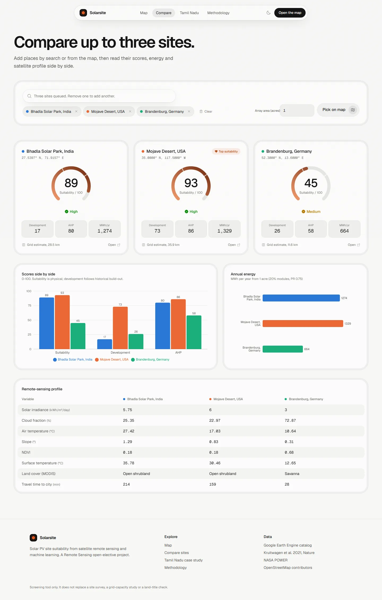
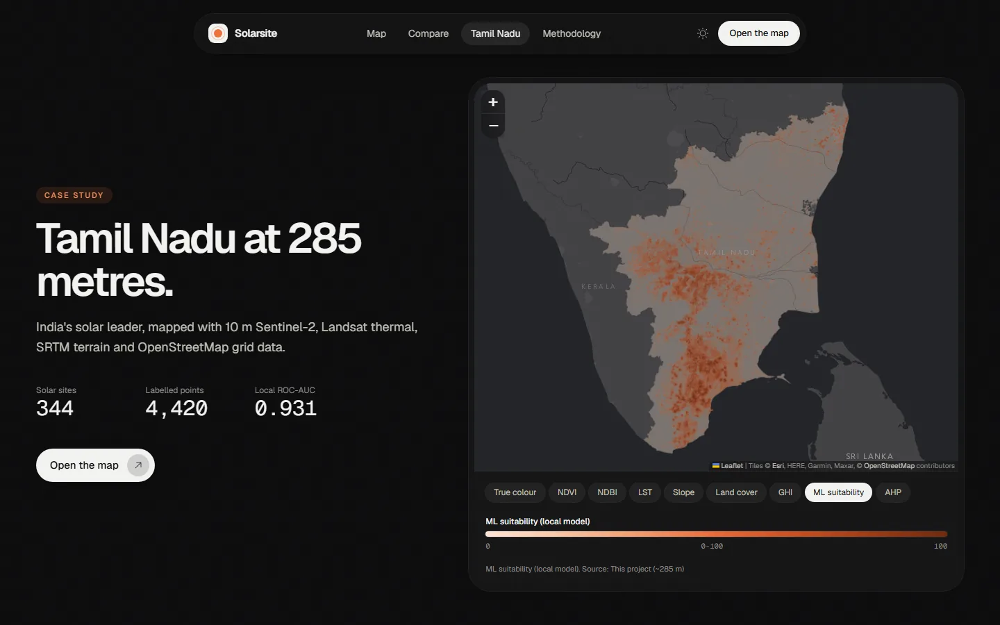
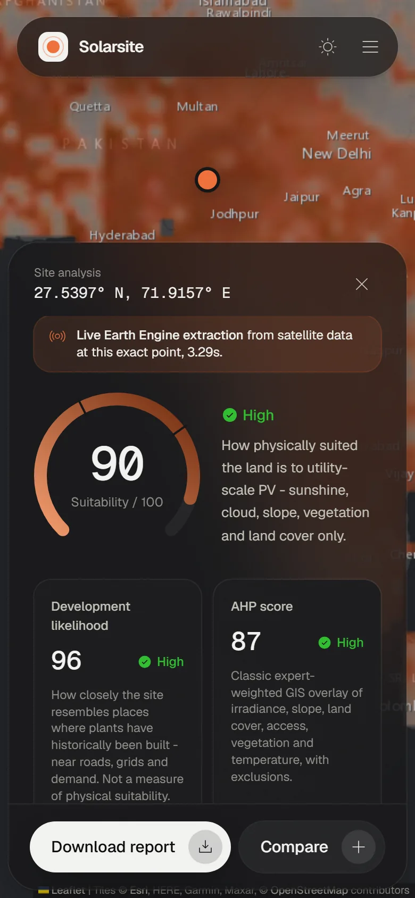
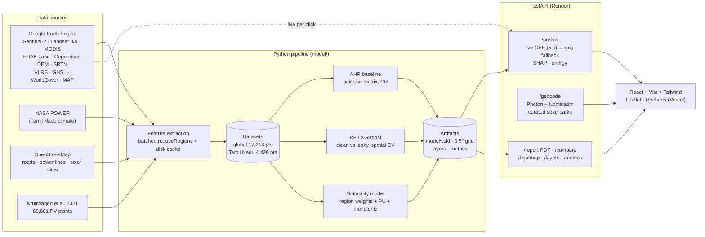

# Solarsite: solar PV site suitability from remote sensing and machine learning

Score any location on Earth for utility-scale solar and see **why**. Satellite and climate data from
Google Earth Engine feed an AHP baseline and machine-learning models trained on 8,213 real solar plants,
served through a FastAPI backend and a React map app. Tamil Nadu, India, is included as a high-resolution
case study (10 m Sentinel-2, Landsat thermal, SRTM and OpenStreetMap grid data).

*Remote Sensing open-elective project.* Full write-up: [`report/methodology.md`](report/methodology.md).



| Map analysis with live Earth Engine data | Why this score (SHAP) |
|---|---|
|  |  |

| Search a famous park, auto-switched to satellite imagery | Excluded land is explained |
|---|---|
|  |  |

| Compare sites | Tamil Nadu case study | Mobile |
|---|---|---|
|  |  |  |

More: [search autocomplete](docs/screenshots/search-autocomplete.webp), [famous-park quick picks](docs/screenshots/map-famous-parks.webp),
[methodology page](docs/screenshots/methodology.webp), [light mode](docs/screenshots/landing-light.webp).

---

## What it does

* **Click anywhere on land** (or search a place, landmark or coordinates) and get:
  * **Suitability** (headline): physical suitability from climate, terrain and land surface only
  * **Development likelihood**: how closely the site resembles where plants have historically been built
    (near roads, grids and demand). It describes where developers go, not how good the land is.
  * **AHP score**: the classic expert-weighted GIS overlay
  * a SHAP explanation, the remote-sensing profile, an energy estimate
    (`E = A × GHI × 365 × 0.20 × 0.75`, area configurable) and a downloadable **PDF site report**
* **Live Earth Engine extraction** per click, with an automatic fallback to a cached 0.5° global grid
  ("grid estimate") when Earth Engine is slow or out of quota. Every live result is cached.
* **Layers:** suitability / development / AHP heatmaps, GHI, NDVI, slope, land cover, LST, night lights,
  population; Tamil Nadu 285 m layers; map or satellite basemap.
* **Compare** two or three sites side by side, and a **methodology** page with every metric.

## Key results

| | ROC-AUC | Notes |
|---|---|---|
| Suitability model (physical, region-balanced, PU, monotonic) | **0.940** plants vs reliable negatives | 12/12 sanity sites correct (deserts and mega-parks High; forest, ice, urban Low) |
| Development-likelihood model (XGBoost, global) | **0.888** test, 0.879 spatial CV | trained on pre-construction (2008-10) features |
| Tamil Nadu local model (Random Forest) | **0.931** test, 0.928 spatial CV | split by solar park |
| AHP baseline | 0.622 global, 0.799 Tamil Nadu | CR = 0.012 / 0.016 (consistent) |
| Leakage experiment | leaky model drops to 0.829 on pre-construction land (clean: 0.888) | imagery of built plants shows the panels |

## Architecture



## Repository layout

```
├── data/
│   ├── raw/          region boundary, OSM solar sites, NASA POWER grid, PV inventory, world regions
│   └── processed/    datasets, 0.5° grid features/predictions, metrics, web layers (WebP)
├── notebooks/        01_gee_extraction · 02_eda · 03_ahp_baseline · 04_training (executed)
├── model/            config, gee(_global), features, power, osm, build_(global_)dataset,
│                     global_grid, tn_rasters, ahp, train, physical, predict, shap_utils, export_layers
│                     model.pkl (development) · model_physical.pkl (suitability) · model_tn.pkl
├── backend/app/      FastAPI app: main, geocode, report (PDF), cache, schemas
├── frontend/         React + Vite + TypeScript + Tailwind v4 + react-leaflet + Recharts
├── report/           methodology.md + figures/
├── scripts/          sync_frontend_assets, screenshots, test_search(_extras)
├── docs/             DEPLOYMENT.md, screenshots/
├── render.yaml       Render blueprint (backend)
└── requirements.txt  full pipeline + backend
```

## Run it locally

**Prerequisites:** Python 3.11, Node 20+, a Google Earth Engine account with a Cloud project
(only needed for live extraction or rebuilding data; the app runs from the committed artifacts without it).

```bash
git clone https://github.com/Mrithikahub/solar-site-suitability.git
cd solar-site-suitability
python -m venv .venv
```

Activate it (`.venv\Scripts\activate` on Windows, `source .venv/bin/activate` on macOS/Linux), then:

```bash
pip install -r requirements.txt
cp .env.example .env          # set GEE_PROJECT_ID
earthengine authenticate      # once, opens a browser
```

Start the API (from the repository root):

```bash
uvicorn backend.app.main:app --reload --port 8000
```

Start the frontend in a second terminal:

```bash
cd frontend
npm install
cp .env.example .env.development   # VITE_API_URL=http://localhost:8000
npm run dev
```

Open http://localhost:5173. API docs: http://localhost:8000/docs.

### Environment variables

| Variable | Where | Purpose |
|---|---|---|
| `GEE_PROJECT_ID` | backend `.env` | Earth Engine Cloud project |
| `GEE_SERVICE_ACCOUNT_JSON` | backend (deployment) | full JSON key of a service account registered with Earth Engine |
| `LIVE_GEE` / `LIVE_GEE_TIMEOUT_S` | backend | live extraction on/off (default on) and timeout (default 5 s) |
| `ALLOWED_ORIGINS` / `ALLOWED_ORIGIN_REGEX` | backend | CORS (frontend URL; regex for Vercel previews) |
| `VITE_API_URL` | frontend | URL of the API |

## Rebuild the data and models

Each step caches its downloads, so re-runs are cheap and interrupted runs resume.

```bash
python -m model.build_dataset              # Tamil Nadu dataset (GEE + NASA POWER + OSM)
python -m model.build_global_dataset       # global dataset (Kruitwagen labels, GEE)
python -m model.build_global_dataset tn    # global features for the Tamil Nadu points
python -m model.global_grid 0.5            # 0.5° prediction grid (0.25 also supported)
python -m model.tn_rasters                 # Tamil Nadu raster stack from cached layer renders
python -m model.ahp                        # AHP baseline, maps, CR
python -m model.train                      # RF/XGBoost, leakage + ablations, SHAP, heatmaps, suitability model
python -m model.export_layers              # web-map overlays + manifest
python scripts/sync_frontend_assets.py     # figures / metrics / imagery for the static pages
```

Notebooks (`notebooks/`) walk through each phase with outputs; regenerate them with
`python notebooks/make_notebooks.py` and execute with `jupyter nbconvert --execute`.

## API

| Method | Endpoint | Description |
|---|---|---|
| POST | `/predict` | `{lat, lon, area_m2?, efficiency?, performance_ratio?}` → scores, class, exclusion, SHAP, features, energy, provenance |
| GET | `/heatmap?scope=global&metric=suitability` | 0.5° grid (all three scores) + overlay URL and bounds |
| GET | `/layers?scope=global\|tamil_nadu`, `/layers/{name}` | layer catalogue, legends, image URLs |
| POST | `/compare` | 2-5 sites, ranked |
| GET | `/report/{lat}/{lon}` | PDF site report |
| GET | `/geocode?q=` | place search (Photon + Nominatim, curated solar parks first, raw coordinates) |
| GET | `/places/famous` | curated famous solar parks |
| GET | `/metrics`, `/health`, `/figures/*` | evaluation results, status, report figures |

## Deployment

Backend on **Render**, frontend on **Vercel**. Step-by-step instructions, including creating the Earth
Engine service account, are in [`docs/DEPLOYMENT.md`](docs/DEPLOYMENT.md).

## Limitations

Grid estimates are regional (nearest 0.5° cell) when live extraction is unavailable; the label inventory
ends in 2018 and is thin in Central Asia and Oceania (flagged in the metrics); land price, grid capacity,
protected areas and flood risk are not modelled. This is a screening tool, not a substitute for a site
survey. See section 13 of the [methodology](report/methodology.md#13-limitations-and-future-work).

## Credits

Data: Google Earth Engine catalog (ESA/Copernicus, NASA/USGS, ECMWF, JRC, NOAA, Malaria Atlas Project),
Kruitwagen et al. (2021) via the awesome-gee-community-catalog, NASA POWER, © OpenStreetMap contributors
(ODbL), Photon by Komoot, Nominatim, Esri basemaps. Built with scikit-learn, XGBoost, SHAP, FastAPI,
ReportLab, React, Vite, Tailwind CSS, Leaflet, Recharts and Motion.
