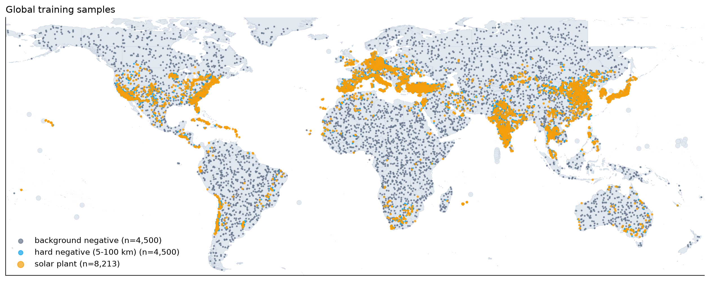
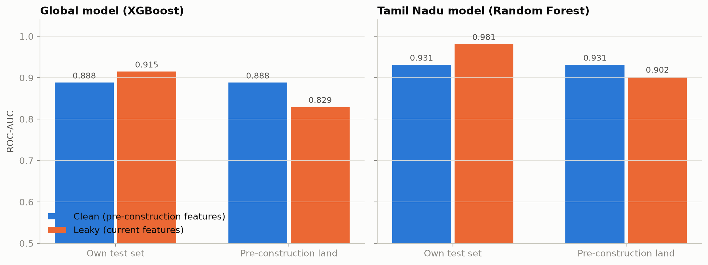
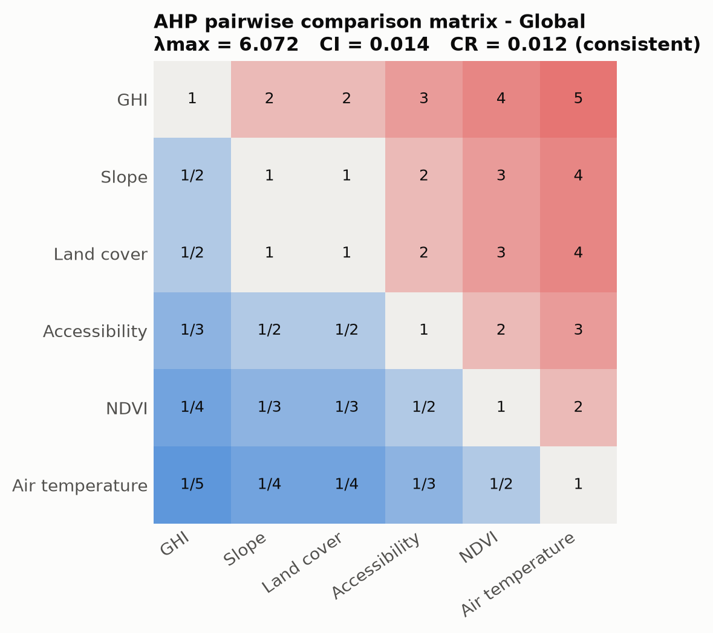
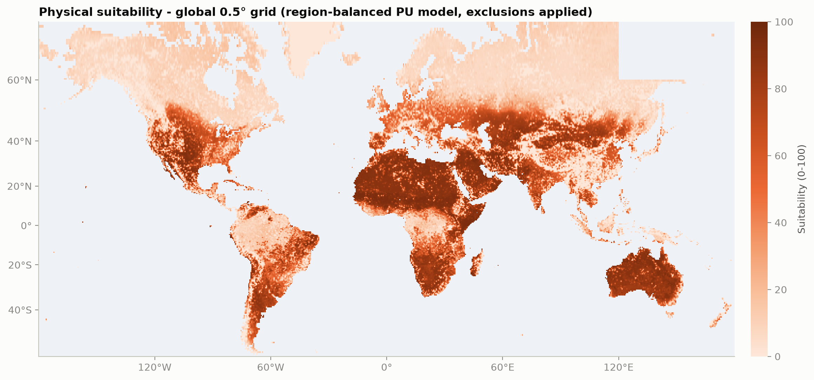
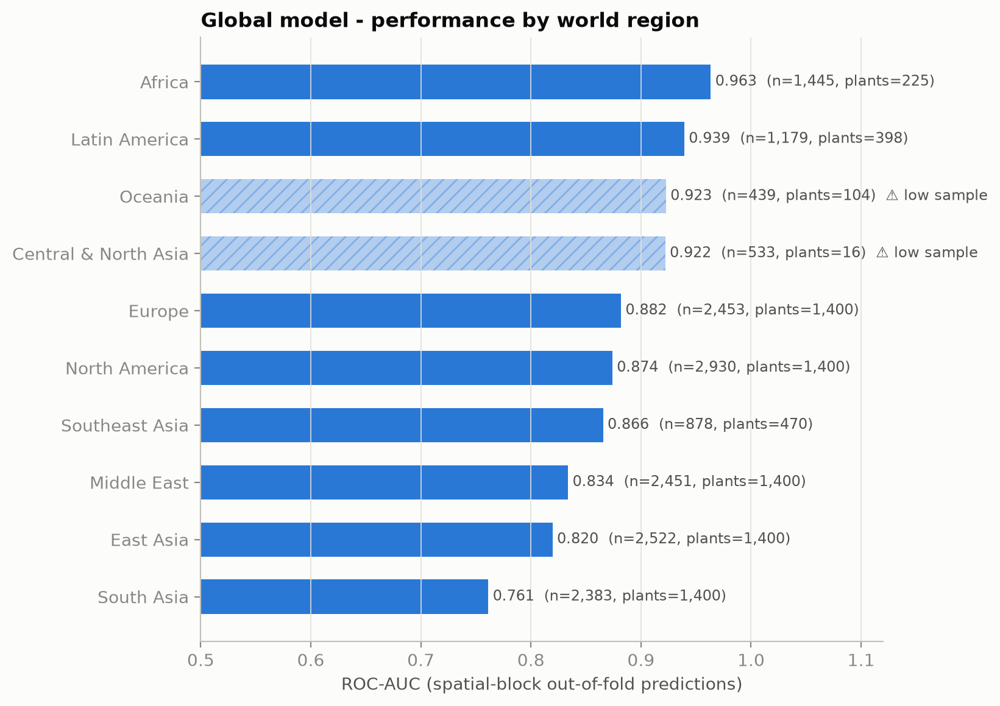
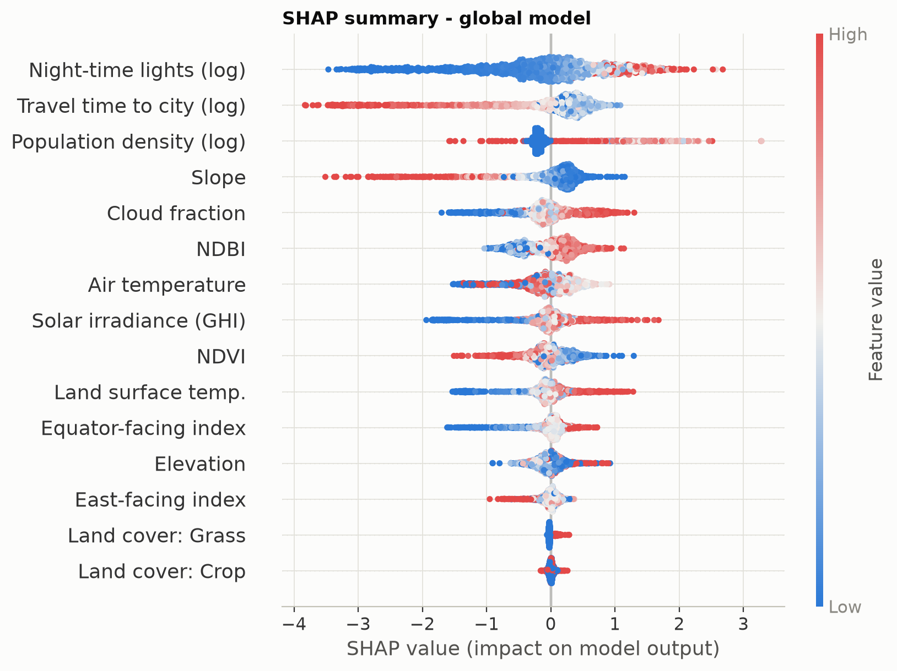

# Solar PV Site Suitability from Remote Sensing and Machine Learning

**Methodology and results.** Remote Sensing open elective project.

All numbers in this report are read from `data/processed/metrics.json`, `ahp_results.json` and
`physical_model.json`, produced by `python -m model.train` (which also runs `model.physical`) and
`python -m model.ahp`. Figures are in `report/figures/`.

---

## 1. Objective

Estimate, for any location on land, how suitable it is for a utility-scale ground-mounted photovoltaic
(PV) plant, and explain why. Two study areas are used:

| Study area | Extent | Resolution | Purpose |
|---|---|---|---|
| **Global** | all land 56° S to 72° N | predictors sampled at 30 m, heatmap on a 0.5° grid (54,996 land cells) | the main model; live per-point analysis on the web map |
| **Tamil Nadu, India** | 130,500 km² | 10-30 m predictors, maps at ~285 m | high-resolution case study with local grid infrastructure |

Three scores are produced for every location:

| Score | Question it answers |
|---|---|
| **Suitability** (headline) | Is the land physically suited to PV? Climate, terrain and land surface only. |
| **Development likelihood** | Does the site resemble places where plants have historically been built (near roads, grids, demand)? |
| **AHP score** | What does the classic expert-weighted GIS overlay say? (baseline) |

---

## 2. Sensors and datasets

### 2.1 Global predictors (all from the Google Earth Engine catalog)

| Sensor / product | Platform & technique | Bands / variables | Wavelength | Spatial res. | Temporal | Use |
|---|---|---|---|---|---|---|
| ERA5-Land monthly (ECMWF) | reanalysis (land surface model forced by ERA5) | `surface_solar_radiation_downwards_sum`, `temperature_2m` | - | 0.1° (~9 km) | monthly, 2005-2024 mean | GHI, air temperature |
| MODIS MOD08_M3 | Terra, passive VNIR/TIR | `Cloud_Fraction_Mean_Mean` | 0.4-14.4 µm (cloud mask) | 1° | monthly, 2005-2024 mean | cloud fraction |
| Copernicus DEM GLO-30 (2024) | TanDEM-X, X-band InSAR (2011-2015) | `DEM` | 3.1 cm (X-band) | 30 m | static | elevation, slope, aspect (pole to pole) |
| MODIS MOD13A1 v6.1 | Terra | `NDVI` (red 620-670 nm, NIR 841-876 nm) | VNIR | 500 m | 16-day | vegetation |
| MODIS MOD09A1 v6.1 | Terra | `sur_refl_b02` NIR, `sur_refl_b06` SWIR-1 | 841-876 nm, 1628-1652 nm | 500 m | 8-day | NDBI |
| MODIS MOD11A2 v6.1 | Terra, thermal (split-window) | `LST_Day_1km` | bands 31/32 (10.8, 12.0 µm) | 1 km | 8-day | land surface temperature |
| MODIS MCD12Q1 v6.1 | Terra + Aqua, supervised classification | `LC_Type1` (IGBP, 17 classes) | - | 500 m | annual | land cover |
| VIIRS DNB monthly (VCMSLCFG) | Suomi NPP, day/night band | `avg_rad` | 0.5-0.9 µm | 15″ (~460 m) | monthly | night-time lights |
| GHSL P2023A | built-up + census disaggregation | `population_count` | - | 100 m | 5-year epochs | population density |
| Malaria Atlas Project | friction surface (roads, rail, water, land cover) | travel time to cities > 50,000 | - | 30″ (~1 km) | 2015 | accessibility |
| ESA WorldCover v200 | Sentinel-1 + Sentinel-2 classification | `Map` (11 classes) | - | 10 m | 2021 | exclusion mask, display |
| RESOLVE Ecoregions 2017 | vector | biome | - | - | static | stratified reporting only |

### 2.2 Tamil Nadu case-study predictors

| Sensor / product | Bands | Wavelength | Resolution | Period | Use |
|---|---|---|---|---|---|
| Sentinel-2 MSI L2A (harmonized) | B2, B3, B4, B8, B11 | 490, 560, 665, 842, 1610 nm | 10 m (B11 20 m) | Sep 2025 - Sep 2026, 2,086 scenes | NDVI, NDBI, true colour |
| Landsat 8/9 OLI/TIRS C2 L2 | SR_B4, SR_B5, SR_B6, ST_B10 | 0.64-0.67, 0.85-0.88, 1.57-1.65, 10.6-11.2 µm | 30 m (TIRS 100 m) | Sep 2025 - Sep 2026 (468 scenes); 2013-15 baseline | LST, pre-construction indices |
| SRTM GL1 v3 | elevation | C-band InSAR (5.6 cm) | 30 m | Feb 2000 | slope, aspect |
| ESA WorldCover v200 | Map | - | 10 m | 2021 | land cover |
| NASA POWER climatology | ALLSKY_SFC_SW_DWN, T2M, CLOUD_AMT | - | 1° (solar), 0.5° × 0.625° (meteorology) | 2005-2024 | GHI, temperature, cloud |
| OpenStreetMap (Overpass) | roads (motorway-tertiary), power lines, substations, solar plants | - | vector | 2026 | grid distances, labels |

### 2.3 Labels

* **Global:** Kruitwagen *et al.* (2021, *Nature* 598, 604-610) inventory of **68,661** PV plant polygons
  detected with deep learning on Sentinel-2 and SPOT imagery up to 2018
  (`projects/sat-io/open-datasets/global_photovoltaic/predicted_set`).
* **Tamil Nadu:** **344** OpenStreetMap solar sites (`power=plant` + `plant:source=solar`, and
  ground-mounted `generator:source=solar` arrays ≥ 5,000 m², polygons within 25 m merged into one site).

---

## 3. Preprocessing

### 3.1 Cloud masking and compositing

* **Sentinel-2:** per-pixel **Cloud Score+** (`GOOGLE/CLOUD_SCORE_PLUS/V1/S2_HARMONIZED`) linked to each
  scene; pixels with `cs_cdf < 0.60` (cloud, thin haze, cloud shadow) are removed, scenes with more than
  60% cloud are skipped. Reflectance = DN / 10,000. A **12-month per-pixel median** gives a
  representative, cloud-free surface state and suppresses residual outliers.
* **Landsat Collection 2:** `QA_PIXEL` bits 0-4 (fill, dilated cloud, cirrus, cloud, cloud shadow) masked;
  scale factors applied (SR = DN × 0.0000275 - 0.2; LST in K = DN × 0.00341802 + 149.0).
* **MODIS:** MOD13A1 `SummaryQA ≤ 1` (good or marginal), MOD09A1 `StateQA` bits 0-1 = clear and bit 2
  (shadow) = 0, MOD11A2 `QC_Day` bits 0-1 ≤ 1.

### 3.2 Spectral indices

$$\mathrm{NDVI} = \frac{\rho_{NIR} - \rho_{Red}}{\rho_{NIR} + \rho_{Red}} \qquad
\mathrm{NDBI} = \frac{\rho_{SWIR1} - \rho_{NIR}}{\rho_{SWIR1} + \rho_{NIR}}$$

| Sensor | NIR | Red | SWIR-1 |
|---|---|---|---|
| Sentinel-2 | B8 (842 nm) | B4 (665 nm) | B11 (1610 nm) |
| Landsat 8/9 | SR_B5 | SR_B4 | SR_B6 |
| MODIS | b2 (841-876 nm) | b1 (620-670 nm, inside MOD13A1) | b6 (1628-1652 nm) |

NDVI separates vegetation (strong NIR scattering by leaf mesophyll, red absorption by chlorophyll) from
bare soil and water; NDBI highlights built-up and bare surfaces, which reflect more SWIR than NIR.

### 3.3 Land surface temperature

Landsat Collection 2 `ST_B10` is produced by USGS with a single-channel algorithm (TIRS band 10, ASTER GED
emissivity adjusted with NDVI, MERRA-2 atmospheric profiles):
`LST [°C] = ST_B10 × 0.00341802 + 149.0 - 273.15`. MODIS MOD11A2 uses the generalised split-window
algorithm on bands 31/32: `LST [°C] = DN × 0.02 - 273.15`.

### 3.4 Irradiance and climate

ERA5-Land accumulates downward shortwave radiation per month in J/m²:

$$\mathrm{GHI}\,[\mathrm{kWh\,m^{-2}\,day^{-1}}] = \frac{\overline{\mathrm{SSRD}_{month}}}{3.6\times10^{6} \times 30.44}$$

Some monthly images store sea pixels as unmasked zeros, so each image is masked (SSRD > 0, T > 150 K)
before averaging, and thin coastal gaps are filled with a 3 × 3 focal mean in the native 0.1° grid.
NASA POWER (Tamil Nadu) is queried on a 0.5° lattice (180 points, cached) and bilinearly interpolated.

### 3.5 Terrain

Slope and aspect come from `ee.Terrain` (3 × 3 finite-difference kernel on the DEM in its native projection).
Aspect is circular, so it is encoded as

$$\text{equator-facing} = -\cos(\text{aspect}) \cdot \operatorname{sign}(\text{lat}) \cdot \min(\text{slope}/10°, 1)$$

(south-facing is best in the northern hemisphere, north-facing in the southern) plus an east-facing
index `sin(aspect) · min(slope/10°, 1)`; both are 0 on flat ground where aspect is meaningless.

### 3.6 Sampling, scale and memory limits

* All rasters are sampled at **30 m** at point locations through `reduceRegions` in batches of 400 points,
  with each batch cached on disk (a crash never repeats work).
* State-wide renders exceed Earth Engine's per-request memory, so each layer is rendered as 16 Web-Mercator
  tiles and stitched locally.
* The Earth Engine project hit its monthly quota (Restricted Mode) during development, so the Tamil Nadu
  AHP and ML maps were built from **decoded layer renders**: each PNG was rendered with known min/max/palette,
  so every colour maps back to one value. Validation against point samples: elevation r = 0.997,
  LST r = 0.941, NDVI r = 0.753 (lower because a ~285 m pixel mixes land around small solar parks).
* The global heatmap samples the current-epoch stack at the **centre of each 0.5° land cell**
  (54,996 cells) instead of exporting aggregated rasters, which would flatten 30 m slopes at 27 km scale.

---

## 4. Labels and sampling design

**Global (17,213 points):**

* **8,213 positives:** one random interior point (≥ 10 m from the edge) per plant ≥ 1 ha with confidence
  A-C, area-weighted and capped at 1,400 plants per world region (LSIB `wld_rgn`, grouped into 10 regions).
* **4,500 background negatives:** area-uniform random points on land.
* **4,500 hard negatives:** 5-100 km from a random plant, i.e. the same landscape and climate but no PV.
  They force the model to learn *local* differences instead of "sunny and populated".
* All negatives are at least 1 km plus the plant radius from any of the 68,661 plants.
* Spatial CV groups: 2° × 2° blocks.

**Tamil Nadu (4,420 points):** 1,768 positives (1 point per 4 ha of site area, 1-20 per site, ≥ 20 m inside
the polygon) and 2,652 negatives ≥ 1 km from any site; CV groups are the solar site (positives) and
0.25° blocks (negatives), so no park appears in both training and test data.

---

## 5. Label leakage and the pre-construction epoch

A satellite looking at an existing plant sees **panels, gravel and access roads**, not the land that was
chosen. At the 8,213 global plant locations:

| | Before construction (MODIS IGBP 2008) | After construction (ESA WorldCover 2021) |
|---|---|---|
| Most common class | Cropland 41%, grassland 23% | **Built-up 41%**, grassland 39% |

GHSL even assigns residents to some panel fields (Kamuthi: 0 people/km² in 2010, 552 in 2025). In Tamil
Nadu at 10-30 m the effect is strong:

| Median at points | Solar 2013-15 | Solar now | Non-solar 2013-15 | Non-solar now |
|---|---|---|---|---|
| NDVI | 0.29 | 0.20 | 0.44 | 0.45 |
| NDBI | 0.05 | **0.25** | -0.03 | -0.01 |

**Design:** time-varying predictors (NDVI, NDBI, LST, land cover, lights, population) are taken from a
**pre-construction epoch** for training (2008-10 MODIS / 2010 GHSL / 2014 VIIRS globally; 2013-15 Landsat
for Tamil Nadu) and from the **current** epoch at prediction time, which is what a prospective site looks
like. ESA WorldCover exists only for 2020-21, so the clean Tamil Nadu model omits land cover.

**Experiment.** Each variant is scored on its own test set and on **pre-construction land** (the same test
points with baseline features):

| Model | Variant | Test ROC-AUC | Spatial CV | AUC on pre-construction land |
|---|---|---|---|---|
| Global XGBoost | **clean** | 0.888 | 0.879 | **0.888** |
| Global XGBoost | leaky (current features) | 0.915 | 0.908 | 0.829 |
| Global XGBoost | as specified (+ WorldCover) | 0.958 | 0.956 | n/a |
| Tamil Nadu RF | **clean** | 0.931 | 0.928 | **0.931** |
| Tamil Nadu RF | leaky | 0.981 | 0.984 | 0.902 |
| Tamil Nadu RF | as specified (+ WorldCover) | 0.984 | 0.986 | n/a |

The leaky and as-specified models look better on paper but degrade on land that has not been built on yet:
they partly learned what a solar farm looks like.

---

## 6. AHP baseline (multi-criteria decision analysis)

Pairwise comparisons on Saaty's 1-9 scale give the matrix **A** (`a_ji = 1/a_ij`); weights are the
normalised principal eigenvector, and consistency is checked with

$$CI = \frac{\lambda_{max} - n}{n - 1}, \qquad CR = \frac{CI}{RI}, \qquad CR < 0.10$$

| Criterion | Tamil Nadu weight | Global weight | Standardisation |
|---|---|---|---|
| GHI | 31.6% | 34.2% | benefit, 4.5→5.8 (TN) / 2.5→6.5 (global) kWh/m²/day |
| Slope | 19.8% | 20.6% | cost, 0→10° |
| Land cover | 19.8% | 20.6% | look-up: bare 1.0, grass 0.9, shrub 0.8, crop 0.55, forest 0.15 |
| Distance to substation | 12.3% | - | cost, 0→20 km |
| Accessibility | - | 12.2% | cost, 30→360 min |
| NDVI | 7.8% | 7.5% | cost, 0.1→0.6 / 0.7 |
| Distance to road | 5.1% | - | cost, 0→5 km |
| Air temperature | 3.5% | 4.9% | cost 25→35 °C / trapezoid (1 between 10-25 °C) |
| **λmax, CI, RI, CR** | 7.130, 0.0216, 1.32, **0.016** | 6.072, 0.0144, 1.24, **0.012** | both consistent |

Exclusions (score = 0): water, wetland, mangrove, built-up / urban, snow and ice, slope > 15°.
Score = 100 × Σ wᵢ sᵢ × constraint. Tamil Nadu map: mean 59.4, 10.5% excluded, 39% ≥ 70.
Global grid: mean 46.4, 18.3% excluded, 27.5% ≥ 70.

---

## 7. Machine-learning models

* **Algorithms:** Random Forest (400 trees, min leaf 2, balanced subsample) and XGBoost (500 trees,
  depth 6, η = 0.05, subsample 0.8), each behind a median imputer.
* **Evaluation:** stratified 80/20 split (grouped by site for Tamil Nadu); stratified 5-fold CV on the
  training data; spatially blocked 5-fold GroupKFold on all data (the honest estimate).
* **Deployed:** the clean variant with the best spatial CV (global: XGBoost, Tamil Nadu: Random Forest).

### 7.1 Results

| Model | Accuracy | Precision | Recall | F1 | ROC-AUC | Spatial CV AUC |
|---|---|---|---|---|---|---|
| Global XGBoost (clean, development likelihood) | 0.808 | 0.764 | 0.864 | 0.811 | 0.888 | 0.879 ± 0.004 |
| Global Random Forest (clean) | 0.804 | 0.751 | 0.881 | 0.811 | 0.889 | 0.878 ± 0.003 |
| Global AHP | 0.611 | 0.559 | 0.873 | 0.682 | 0.622 | - |
| Tamil Nadu Random Forest (clean) | 0.843 | 0.841 | 0.749 | 0.792 | 0.931 | 0.928 ± 0.014 |
| Tamil Nadu XGBoost (clean) | 0.828 | 0.816 | 0.737 | 0.774 | 0.927 | 0.925 ± 0.012 |
| Tamil Nadu AHP | 0.524 | 0.457 | 1.000 | 0.627 | 0.799 | - |

Confusion matrices (test sets): global XGBoost TN = 1,361, FP = 439, FN = 223, TP = 1,420;
Tamil Nadu RF TN = 480, FP = 50, FN = 89, TP = 265.

**ML vs AHP.** The data-driven models beat AHP by +0.27 AUC globally and +0.13 in Tamil Nadu. AHP encodes
physical potential with fixed expert weights; it ranks Tamil Nadu plants reasonably but rewards the
Sahara, Arabia and central Australia, where little PV has been built because grids and demand are far away.

**Global vs local on Tamil Nadu** (same site-grouped test split): local RF AUC 0.931 / F1 0.792,
global XGBoost AUC 0.860 / F1 0.731, AHP AUC 0.799 / F1 0.627. The global model has never seen the OSM
Tamil Nadu labels, so this is a genuine out-of-sample transfer test.

### 7.2 What the development model learned

Top SHAP drivers (mean |SHAP|): night-time lights 0.78, travel time to city 0.62, population 0.40,
slope 0.39, cloud fraction 0.33, NDBI 0.30. **The model learned where developers build**: close to grids
and demand. It scores Bhadla (India, one of the world's largest parks) 17 and the Atacama 21, while Berlin
scores 62. Cloud fraction even pushes scores *up*, because Germany and Japan built many plants under cloudy
skies. This is why its output is presented as **development likelihood**, not suitability.

Physical-only ablation (lights, access, population removed): global AUC 0.850, Tamil Nadu 0.883. Physical
factors alone carry most of the signal; human proxies add ~0.04-0.05 AUC.

---

## 8. Physical suitability model (headline score)

Plain supervised learning cannot measure physical suitability, because the absence of a plant is caused
by economics as much as physics. Four fixes, applied in `model/physical.py`:

1. **Physical predictors only:** GHI, air temperature, cloud fraction, elevation, slope, aspect indices,
   NDVI, NDBI, LST, IGBP land-cover dummies.
2. **Region-balanced sample weights:** every (world region × class) cell gets the same total weight, capped
   at 10× the median weight so a region with 16 plants cannot dominate.
3. **Positive-unlabelled (PU) learning with reliable negatives:** a point without a plant is *unlabelled*,
   not *unsuitable*. Following the two-step PU approach, a negative is kept only if its physical
   plausibility (the AHP overlay without the accessibility criterion, weights renormalised, evaluated on the
   pre-construction epoch) is below 60. **4,610 reliable negatives** are kept (forest, ice, wetland, steep,
   urban or low-irradiance land); **4,390** physically plausible negatives (open, flat, sunny land) are
   treated as unlabelled and excluded from this model's training.
4. **Monotonic constraints (XGBoost):** GHI ↑ never lowers the score; cloud fraction, slope, NDVI and the
   forest, water, wetland, snow and urban dummies ↑ never raise it. A shallow booster (depth 3,
   300 trees) plus logit temperature scaling `score = 100 · σ(logit(p) / 2)` restores gradation (PU
   probabilities are uncalibrated and saturate) without changing the ranking.

At prediction time the MCDA exclusion mask is applied (water, wetland, snow/ice, urban, slope > 15°) and the
user sees e.g. *"Excluded: urban area, not suitable for ground-mounted solar."*

| Step | AUC vs all negatives | AUC vs reliable negatives | Spatial CV (reliable) |
|---|---|---|---|
| Before: RF, unweighted | 0.850 | 0.887 | 0.871 |
| Region-balanced + monotonic | 0.781 | 0.860 | 0.871 |
| **+ reliable negatives (final)** | 0.660 | **0.940** | **0.940** |

The AUC against *all* negatives drops by design: open sunny land without a plant now scores as suitable.

**Sanity check** (features from one cached Earth Engine sample at the exact coordinates):

| Site | Expected | Before | Final |
|---|---|---|---|
| Bhadla Solar Park, India | High | 34.9 | **89.7** |
| Atacama Desert, Chile | High | 38.3 | **87.2** |
| Kamuthi Solar Park, India | High | 69.7 | **92.0** |
| Central Sahara, Algeria | High | 5.5 | **88.4** |
| Nevada desert (Tonopah), USA | High | 70.7 | **87.9** |
| Benban Solar Park, Egypt | High | 13.4 | **91.0** |
| Tengger Desert Solar Park, China | High | 31.9 | **83.6** |
| Noor Ouarzazate, Morocco | High | 66.6 | **91.1** |
| Berlin city centre | Low | 60.6 | **0** (urban excluded; model 42.6) |
| Amazon rainforest | Low | 3.2 | **20.7** |
| Siberian taiga | Low | 0.0 | **6.9** |
| Greenland ice sheet | Low | 1.2 | **0** (ice excluded) |

12 / 12 sites pass. On the global grid: mean 38.7; 29.4% High (≥ 70), 14.7% Medium, 55.9% Low.

---

## 9. Performance by world region

Development model, spatially blocked out-of-fold predictions (every point predicted by a model that never
saw its 2° block):

| Region | Points | Plants | ROC-AUC | F1 | Note |
|---|---|---|---|---|---|
| Africa | 1,445 | 225 | 0.964 | 0.771 | |
| Latin America | 1,179 | 398 | 0.939 | 0.804 | |
| Oceania | 439 | 104 | 0.923 | 0.597 | **low sample (< 150 plants)** |
| Central & North Asia | 533 | 16 | 0.922 | 0.581 | **low sample (< 150 plants)** |
| Europe | 2,453 | 1,400 | 0.882 | 0.835 | |
| North America | 2,930 | 1,400 | 0.874 | 0.787 | |
| Southeast Asia | 878 | 470 | 0.866 | 0.834 | |
| Middle East | 2,451 | 1,400 | 0.834 | 0.799 | |
| East Asia | 2,522 | 1,400 | 0.820 | 0.773 | |
| South Asia | 2,383 | 1,400 | 0.761 | 0.758 | |

High AUCs in Africa and Latin America partly reflect easy background negatives (remote desert and forest);
South and East Asia are hardest because plants and negatives share dense, similar agricultural landscapes.
The two flagged regions have too few labels for stable metrics.

---

## 10. Explainability

`shap.TreeExplainer` gives exact Shapley values for tree ensembles, so every prediction decomposes as
`f(x) = E[f] + Σ φᵢ`. On the web map each site's contributions are rescaled to score points (they sum to
score minus the model's average). Land-cover dummies with value 0 are shown as "Not forest" etc.

Tamil Nadu (Random Forest): land surface temperature 17.8%, distance to substation 13.9%, cloud cover 13.5%,
NDVI 13.5%, GHI 7.1%, elevation 6.6%. Parks cluster along the transmission network on hot, low-NDVI land.

---

## 11. Energy estimate

$$E\,[\mathrm{kWh/yr}] = A \times \mathrm{GHI} \times 365 \times \eta \times PR$$

with A = 4,046.86 m² (1 acre, configurable), η = 0.20, PR = 0.75. At GHI 5.4 kWh/m²/day one acre yields
about 1,200 MWh/yr (809 kWp at STC, ~1,480 kWh/kWp). CO₂ avoided uses the IEA world-average grid
intensity of 0.475 kg/kWh.

---

## 12. Web application

* **Live analysis:** a click runs one Earth Engine `reduceRegions` call on the current-epoch stack
  (5 s timeout); if Earth Engine is restricted or slow, the nearest 0.5° grid cell is used and the result is
  labelled "Grid estimate". Every live result is cached, including ones that finish after the timeout.
* **Search:** Photon (typo-tolerant, OSM) with automatic variants and re-ranking, Nominatim fallback,
  curated famous solar parks ranked first; POIs fly to zoom 15-17 on satellite imagery and auto-analyse,
  areas fit their bounding box.
* **Outputs:** gauge, three scores, SHAP chart, remote-sensing profile, energy calculator, PDF report,
  side-by-side comparison of up to three sites.

---

## 13. Limitations and future work

* **Grid estimates** use the nearest 0.5° cell (up to ~40 km away) when live Earth Engine extraction is
  unavailable; a 0.25° grid is prepared (`python -m model.global_grid 0.25`).
* **Decoded Tamil Nadu rasters** are 8-bit quantised (~1/255 of the display range) and clipped to the
  display range (elevation > 1,800 m reads as 1,800 m).
* **Labels end in 2018** and under-represent Central Asia (16 plants) and Oceania (104).
* **Reliable negatives** are chosen with an expert physical-plausibility rule, so the suitability model
  inherits part of the AHP's assumptions (a deliberate, documented prior).
* **Not modelled:** land tenure and price, grid capacity, flood and dust risk, protected areas,
  water availability for cleaning.
* **Boundary artefact:** the far north-east of Siberia (east of 120° E, north of 62° N) is missing from the
  global grid because the simplified LSIB polygons split at the antimeridian.
* Future work: MCD12Q1 and Sentinel-2 time series to date construction automatically, PVGIS/NSRDB
  irradiance for higher resolution, a protected-areas (WDPA) exclusion layer.

---

## 14. References

* Kruitwagen, L., Story, K. T., Friedrich, J., Byers, L., Skillman, S., Hepburn, C. (2021). A global inventory
  of photovoltaic solar energy generating units. *Nature*, 598, 604-610.
* Saaty, T. L. (1980). *The Analytic Hierarchy Process.* McGraw-Hill.
* Elkan, C., Noto, K. (2008). Learning classifiers from only positive and unlabeled data. *KDD*.
* Lundberg, S. M., Lee, S.-I. (2017). A unified approach to interpreting model predictions. *NeurIPS*.
* Chen, T., Guestrin, C. (2016). XGBoost: a scalable tree boosting system. *KDD*.
* Pasquarella, V. J. *et al.* (2023). Comprehensive quality assessment of optical satellite imagery using
  weakly supervised video learning (Cloud Score+). *CVPR Workshops*.
* Muñoz-Sabater, J. *et al.* (2021). ERA5-Land: a state-of-the-art global reanalysis dataset for land
  applications. *Earth System Science Data*, 13, 4349-4383.
* Weiss, D. J. *et al.* (2018). A global map of travel time to cities to assess inequalities in accessibility
  in 2015. *Nature*, 553, 333-336.
* Zanaga, D. *et al.* (2022). ESA WorldCover 10 m 2021 v200.
* Gorelick, N. *et al.* (2017). Google Earth Engine: planetary-scale geospatial analysis for everyone.
  *Remote Sensing of Environment*, 202, 18-27.
